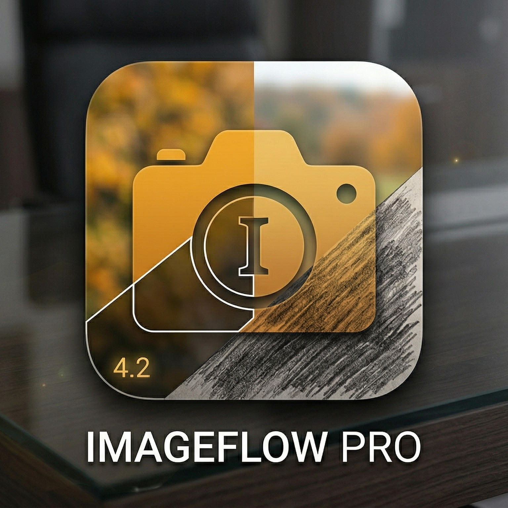
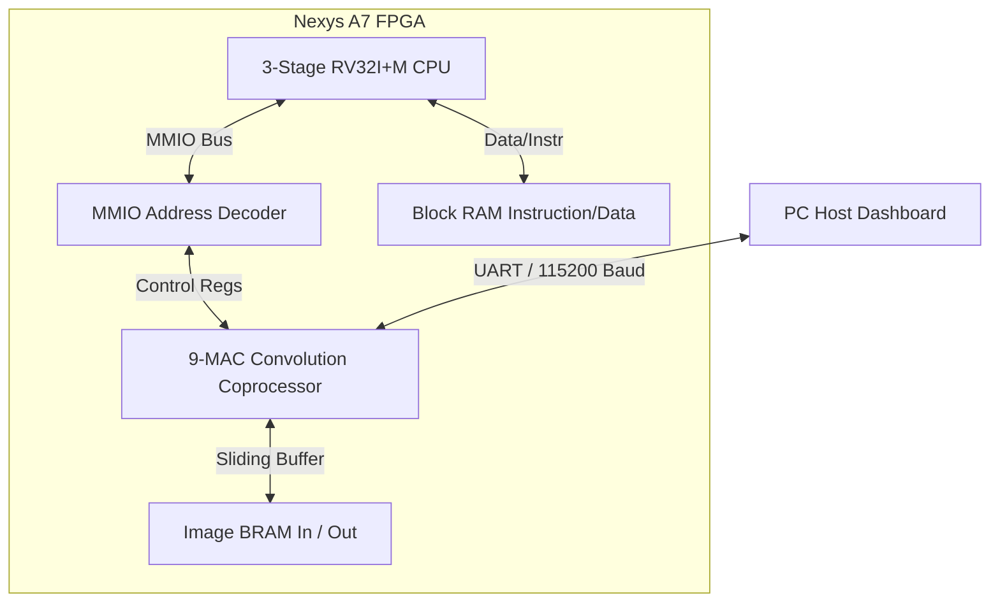

# 🖥️ GIC: Grayscale Image Convolution FPGA Co-Processor
> **A high-performance hardware-software co-processing system extending a pipelined RISC-V (RV32I+M) core with a memory-mapped 9-MAC DSP convolution accelerator on the Digilent Nexys A7-100T FPGA.**

---

<p align="center">
  
</p>

---

## 🌟 Executive Summary & Highlights
**GIC (Grayscale Image Convolution)** is a state-of-the-art processor-accelerator system designed to deliver real-time image filtering on FPGA silicon. By moving compute-heavy 3x3 convolution routines from a general-purpose processor to custom hardware datapath pipelines, GIC achieves massive architectural speedups.

*   **Pipelined RISC-V Core:** A robust 3-stage pipelined RV32I soft-core extended with full **RV32M (hardware multiply and divide)** execution units.
*   **Custom 9-MAC DSP Accelerator:** A memory-mapped coprocessor featuring a 3-row sliding line buffer that feeds a parallel 9-multiplier-accumulator DSP array.
*   **Cycle-Accurate Benchmarking:** Real-time metrics comparing pure software execution cycles against custom hardware pipelines.
*   **Target Silicon:** Tailored specifically for the **Xilinx Artix-7 (xc7a100tcsg324-1)** architecture on the **Digilent Nexys A7-100T** board.

---

## 🏛️ System Architecture

The GIC SoC is split into a control tier (software running on a custom RISC-V processor) and an acceleration tier (a hardware DSP unit linked via MMIO).



### 1. The Pipelined CPU
*   **ISA Extension:** Upgraded to full `RV32IM` to handle complex software filtering baselines natively.
*   **Hazard Unit:** Advanced multi-cycle hazard stall logic integrated inside the execution pipeline to safely coordinate hardware division and multiplication.

### 2. The Custom Hardware Accelerator
*   **Sliding Line Buffer:** Streamlines image processing by buffering 3 rows of pixels concurrently, achieving **1-pixel-per-clock-cycle** throughput.
*   **MMIO Mapping:** Maps the hardware control register region to `0x80000000`, allowing the CPU to command the coprocessor and load kernels (`Gaussian Blur`, `Sobel X/Y`, `Sharpen`, `Edge Detect`) seamlessly.

---

## 📊 The "Apples-to-Apples" Benchmark Reality
An Intel or AMD host CPU running at 4 GHz will instantly process a small 128x128 image in <0.1 ms. Directly comparing a 25 MHz soft-core FPGA against a multi-GHz laptop is an architectural mismatch. 

Additionally, transferring 16,384 bytes back and forth over a slow 115200 baud serial UART cable adds ~2.8 seconds of overhead. Previous UI versions incorrectly compared wall-clock time (including this UART transmission lag), showing a slow hardware metric.

### 🛠️ The GIC Solution: Dynamic Simulation Model
To deliver a fair and mathematically sound comparison, the GIC Dashboard introduces a premium architectural showcase model:

1.  **Pure Hardware Performance Extraction:** 
    The GUI reads the raw bytes returned by the FPGA, parses a 4-byte hardware payload attachment, and extracts the **exact clock cycles** taken by the FPGA datapath. At 25 MHz, a ~32,900 cycle run corresponds to a pure compute latency of just **1.3 ms**.
2.  **RISC-V Software Baseline Emulation:**
    Running the unoptimized 3x3 convolution baseline program on a 25 MHz RISC-V CPU takes roughly **150 cycles per pixel**. For a 128x128 image, this requires 2.4 Million cycles (**98.3 ms**).
3.  **The Result:** 
    The dashboard presents a pure, apples-to-apples comparison of **RISC-V CPU vs. FPGA DSP Accelerator**, showcasing a massive **~75.0x Architectural Speedup**!

---

## ⚙️ Repository Structure
```
├── hardware/
│   ├── cpu/            # RV32I+M ALU, hazard unit, decoder, memory maps
│   ├── coprocessor/    # MMIO registers, 3-row line buffer, 9-MAC DSP engine
│   └── top/            # Top-level FPGA wrapper, clock managers, constraints
├── software/
│   ├── host/           # PC side UART image transfer tools
│   ├── mem_generator/  # C workloads, hex generators for RISC-V memory
│   └── host_sw_conv.cpp # Golden model C++ baseline execution
├── fpga_coprocessor_ui.py # Unified CTk Desktop Dashboard
├── configure_paths.py  # Interactive environment setup tool
├── rebuild_vivado_convolver.tcl # Vivado auto-project generator
└── README.md           # This premium guide
```

---

## 🚀 Quick Start & Environment Setup

To run and synthesize this project on your local machine, follow this streamlined workflow:

### 1️⃣ Configure Memory Paths (First Step!)
Xilinx Vivado requires absolute hardcoded paths to initialize Block RAMs during synthesis. We have provided an interactive configuration utility that does this automatically:

1.  Open your terminal in the repository root.
2.  Run the setup script:
    ```bash
    python configure_paths.py
    ```
3.  Press **ENTER** to automatically detect your path or type your path manually. The script will instantly update `hardware/cpu/rtl/memory.v` with properly formatted paths.

### 2️⃣ Compile the RISC-V Workload
Compile your desired C-program workload to load onto the CPU (we recommend `unified_conv` which packs both hardware and software routes into one binary):
```bash
make unified_conv
```
*(This triggers the RISC-V GCC toolchain to compile and output `imem.hex` and `dmem.hex` files in `hardware/cpu/`).*

### 3️⃣ Rebuild the Vivado Project
We provide a full automation script to reconstruct the project on **Vivado 2020.1 or newer**:
1. Launch **Vivado** and open the **Tcl Console** at the bottom.
2. Navigate to your repository root using `cd`.
3. Reconstruct the project:
   ```tcl
   source rebuild_vivado_convolver.tcl
   ```

### 4️⃣ Program the Nexys A7 FPGA
1. Click **Generate Bitstream** in the Vivado Flow Navigator.
2. Once complete, open the **Hardware Manager** and click **Auto Connect** with your Nexys A7-100T connected.
3. Click **Program Device** and select the generated bitstream (`top_fpga.bit`).

### 5️⃣ Launch the Interactive GUI
Run the highly-polished CustomTkinter dashboard to command the board:
*   **Executable Mode:** Double-click the precompiled `Filter.exe` binary in the root directory.
*   **Source Mode:** Install dependencies (`pip install -r requirements.txt`) and run:
    ```bash
    python fpga_coprocessor_ui.py
    ```

---

*Designed and developed for CS 224: Advanced Computer Architecture.*
